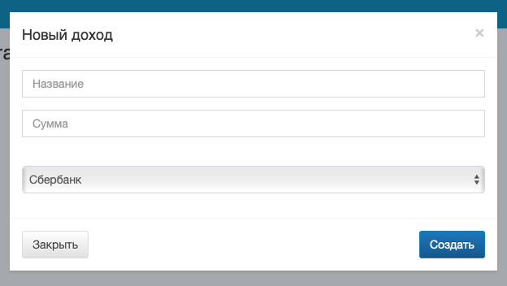

# Управление всплывающими окнами



Для всплывающих окон выделен класс *Modal* (файл *public/js/ui/Modal.js*). 
Вам необходимо реализовать управление данными окнами.

## Общее описание

Пример HTML-кода всплывающего окна
(такие всплывающие окна вы можете найти в коде страницы *index.html*):

```html
<div class="modal fade in" id="modal-new-account">
    <div class="modal-dialog">
        <div class="modal-content">
            <div class="modal-header">
                <button type="button" class="close" data-dismiss="modal" aria-label="Закрыть">
                    <span aria-hidden="true">×</span></button>
                <h4 class="modal-title">Новый аккаунт</h4>
            </div>
            <div class="modal-body">
                <form class="form" id="new-account-form">
                    <div class="form-group">
                        <input type="text" class="form-control" placeholder="Название" name="name" required>
                    </div>
                </form>
            </div>
            <div class="modal-footer">
                <button type="button" class="btn btn-default pull-left" data-dismiss="modal">Закрыть</button>
                <button type="submit" class="btn btn-primary" form="new-account-form">Создать</button>
            </div>
        </div>
    </div>
</div>
```

В коде есть элементы с атрибутами *data-dismiss* со значением *modal*. Эти элементы
закрывают окно.

Пример работы класса

```javascript

const element = 
  modal = new Modal( element );
```

## Структура 

Состоит из 6 частей:

1. Конструктора
2. *open* открывает окно
3. *close* закрывает окно
4. *onClose* срабатывает при нажатии на кнопку «Закрыть»
5. *registerEvents* задаёт обработчик нажатия на кнопки «Закрыть».
6. *unregisterEvents* удаляет обработчик нажатия на кнопки «Закрыть».

### constructor

Важные детали:

1. Если передан пустой элемент в конструктор, должна быть выброшена ошибка.
2. Сохраните переданный элемент в свойство *element*
3. Вызовите метод *registerEvents()*

### open

Открывает всплываюее окно. В контейнер (свойство *element*) устанавливает
css-свойство *display* со значением *block*.

### close

Закрывает всплывающее окно. В контейнере (свойство *element*) удаляет
css-свойство *display*.

### onClose

Срабатывает после нажатия на элементы, закрывающие окно. Закрывает текущее окно используя метод *close()*

### registerEvents

Находит внутри контейнера (свойство *element*) все элементы, которые имеют
атрибут *data-dismiss* со значением *modal*. Устанавливает обработчик событий
для этих элементов, которые вызывают метод *onClose()*.

### unregisterEvents

*unregisterEvents* удаляет обработчик *onClose* с закрывающих окно элементов

## Подсказки и советы

<details>

<summary>Показать</summary>

### Селектор атрибута

В CSS есть селектор, который можно использовать для поиска кнопки,
закрывающей всплывающее окно:

```html
<input name="bobik" type="text">
```

```css
/* найти элемент с */
[name="bobik"] {
  color: black;
}
```

Вы можете использовать эту конструкцию для поиска элементов в JavaScript

### Ссылки

Не забывайте, что некоторые элементы, закрывающие окно могут быть ссылками
и оказывать нежелательный эффект перехода на другую страницу.

</details>
